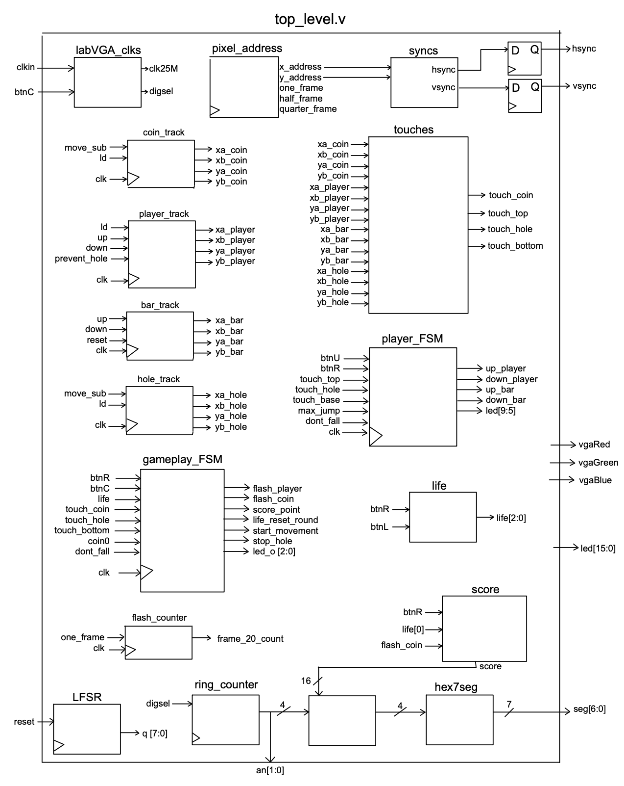

# FPGA Platformer Game

A side-scrolling platformer game built in Verilog and implemented on an Basys3 FPGA with real-time VGA graphics output. The player must jump over obstacles, collect coins, and survive as the game continuously updates on screen.

The project was designed as a hardware-focused game system, with all game logic, graphics rendering, timing, and input handling implemented using only structural Verilog.

## Overview
* Graphics render through VGA output
* Random-width holes generate on the right side of the screen and move left
* Player jumps to avoid falling into holes
* Collect coins for score. Coins generate at different heights that require timed jumps
* Coin score is displayed on the FPGA seven-segment display
* Player flashes when losing a life and coins flash when points are awarded
* Player has 3 lives before game over

## Demo

      
    <i>Purple player jumps and reaches coin, scoring 1 point displayed on FPGA</i>

      
    <i>Pressing the L button enables 3-life mode shown by LEDs. The player collides with an obstacle and loses one life.</i>

## Hardware Design

The project was built on an FPGA development board and written entirely in Verilog.

Major hardware components include:
* Clock divider modules for game timing and VGA synchronization
* Finite state machines for player movement and overall game control
* LFSR-based pseudo-random generation for obstacle and coin placement
* Collision detection logic for player, coins, and obstacles
* Seven-segment display driver for score output
* LEDs used to indicate remaining player lives
* Power bar that visually displays jump strength

VGA output is generated by continuously tracking horizontal and vertical pixel coordinates, allowing game objects to be rendered directly in hardware.

## System Architecture

The diagram below shows the top-level hardware architecture of the FPGA game system. The `top_level.v` module connects all subsystems and coordinates communication between game logic and VGA output. Video generation begins with the `labVGA_clks`, `pixel_address`, and `syncs` modules, which generate the 25 MHz VGA clock, track the current pixel position on screen, and produce the synchronization signals required for display output.

Game objects are handled through dedicated tracking modules. `player_track`, `coin_track`, `hole_track`, and `bar_track` continuously update the positions of the player, collectible coins, obstacles, and moving platforms. A separate `touches` module monitors interactions between objects and generates collision signals whenever the player contacts a coin, obstacle, platform, or reaches the bottom of the hole.

Game behavior is controlled through two finite state machines. `player_FSM` manages player movement including horizontal movement, jumping, falling, and platform interactions. `gameplay_FSM` controls higher-level game behavior such as score updates, coin flashing, obstacle movement, round resets, and game progression based on collision events.

Supporting modules manage additional game state. The `life` module tracks player lives, `score` handles point accumulation when coins are collected, and the `LFSR` module generates pseudo-random values used for obstacle or object behavior. Finally, the `ring_counter` and `hex7seg` modules drive the seven-segment display used to output score and game status in real time.

The overall design emphasizes modular RTL development, with each subsystem operating independently while communicating through shared control and status signals, similar to how larger digital systems are partitioned in FPGA and ASIC design.

  

## Project Structure

Key modules:

* `top_level.v` — top-level system integration
* `FSM_player.v` — player movement and jump state logic
* `FSM_gameplay.v` — overall game state control
* `track_player.v` — player position tracking for falling and jumping
* `coin_track.v` — coin generation and tracking
* `hole_track.v` — generates random hole width and tracks obstacle position
* `pixel_address.v` — pixel coordinate generation
* `syncs.v` — VGA synchronization signals
* `life.v` — player life tracking
* `lfsr.v` — pseudo-random obstacle generation
* `touch.v` — collision detection across player/coin/hole/floor
* `score.v` — score tracking and trigger coin flashing
  
## Debugging Techniques
Several hardware debugging methods were built into the design during development.
* Switch 14 disables obstacle collisions, allowing coin collection to be tested independently
* LEDs [0:10] display internal states from both finite state machines
* Button L enables 3-life mode for testing life and game-over behavior
* Testbenches were created for individual modules to isolate and resolve bugs

## Technical Concepts

This project focused heavily on low-level digital design concepts including:

* Structural Verilog design
* Sequential and combinational logic
* Finite state machine design
* VGA timing generation
* Clock domain management
* Collision detection logic
* Modular RTL design

## Acknowledgements
Special thanks to Professor Dustin Richmond and all of the TAs for their guidance and support in class.  
<i>Built for CSE 100 Digital Logic, UC Santa Cruz — June 2025</i>
